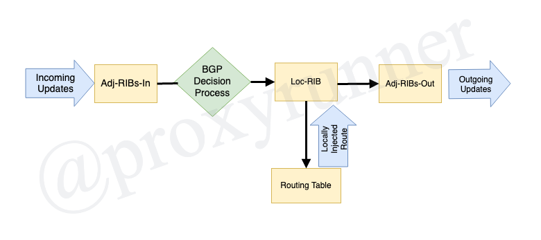

# BGP Attributes: Basic BGP Policy Concepts

Click here to return to the [BGP Table of Contents](../README.md).

## The BGP Decision Concepts

* Step-by-step decision process
* BGP Routing Information Bases (RIBs)
* The relatioship of policies to the RIBs

## The IOS BGP Decision Process

* Used to choose among multiple paths to the same destination
* Different vendor's BGP implementations can have slightly different decision processes

1. Prefer the highest __WEIGHT__
2. Prefer the highest __LOCAL_PREF__
3. Preefer locally originated routes
4. Prefer shorest __AS_PATH__
5. Prefer lowest __ORIGIN__ (IGP < EGP < Incomplete)
6. Prefer lowest __MED__
7. Prefer EBGP paths over IBGP paths
8. Prefer lowest IGP metric to __NEXT_HOP__
9. If both paths are external, prefer the oldest (first received) path
10. Prefer lowest Router ID (or __ORIGINATOR_ID__ if route reflectors used)
11. Prefer shortest __CLUSTER_LIST__
12. Prefer lowest neighbor IP address

## The BGP Routing Information Base

* BGP Routing Information Base (RIB) stores known prefixes
* Consists of 3 parts:
* Adj-RIBs-In
    + Stores routes learned from incoming Update messages
* Loc-RIB
    + Derivced from Adj-RIBs-In by decision process and locally injected prefixes
* Adj-RIBs-Out
    + Stores routes to be advertised to neighbors in Update messages
    + Derivce from Loc-RIB

### With Routing Policy

---

[Previous Lesson](./7.1.md)

[Click here for the next lesson!](./8.1.md)
