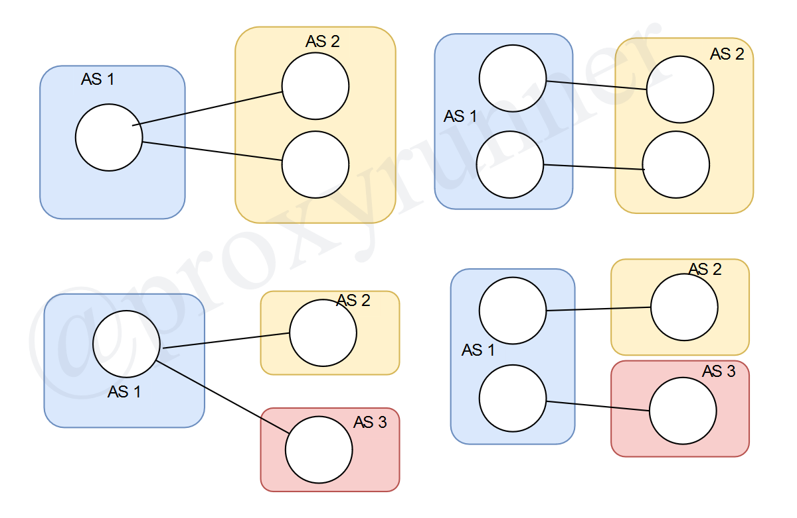
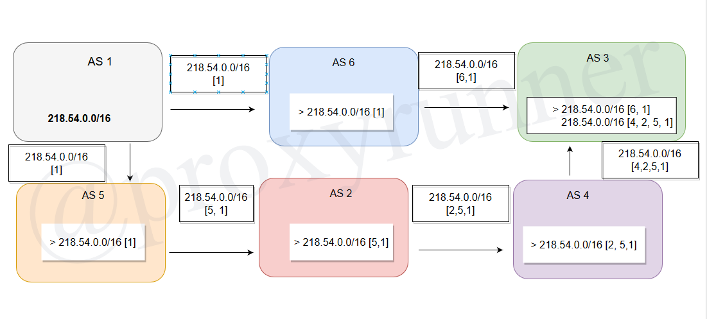

# Basic BGP Concepts

From here you can [return to the previous lesson](./1.1.md) or return to the [table of contents](../README.md).

## 1.2 - Inter-Domain Routing

* Types of AS
* Inter-AS multi-homing
* BGP AS_PATH attribute

## Types of AS

An autonomous system can be:

* Single-home
    + one link to an external peer
* Multi-homed
    + multiple links to one or more external peers

## Single-Homed

* only one connection to an external peer
* no need for incoming BGP here
    + no choices about external routes
    + there is no decisions to be made because there's only a single path for the router to take
* outgoing BGP might be used
    + to advertise internal prefixes to external peer
    + alternative: external peer uses static routes to AS 1 prefixes

## Multi-Homed AS'

* multiple connections to external peers
    + in one or more neighboring AS
* incoming BPG might be needed here
    + for multiple choices to the same destination

## Stub

* all packets entering the AS are to destinations in the AS
* all packets leaving the AS are from sources in the AS

## Transit

* packets entering the AS can be to destinations in another AS
* BGP almost always used here

!Stub-transit Example](../../../img/stub-transit.png)

## The BPG AS_PATH attribute

* One of many BPG path attributes
    + path attributes enable BPG routing policies
    + other attributes introduced in subsequent lessons
    + AS_PATH also enables two key BGP functions
* AS_PATH is a list of AS numbers describing the inter-AS path to a destination
* AS_PATH has two functions:
    1.The __shortest__ AS path selection
    2. Loop avoidance

### Shortest Path Determination

* AS chooses shortest AS path
    + based onthe AS_PATH with the fewest AS on the list
    + BGP decision process, discussed in Basic BGP Polict Concepts
    + AS number prepended to AS_PATH
    + provides sequential description of the inter-AS path to the destination
    + only by AS border router before advertising to its external peer
* behavior is similar to distance vector
    + __however__, BGP is a _Path Vector_ protocol.
    + path vector protocols are vulnerable to loops

#### Loop Issue (Loop Avoidance)

* If a router sees itself in its own AS number in the Path Attribute, the packet will be dropped

Better phrased:

__AS_Path__ Loop Avoidance: Drops routes received from external peers if the local AS number is listed in the AS_PATH

[Click here for the next lesson!](./2.1.md)
