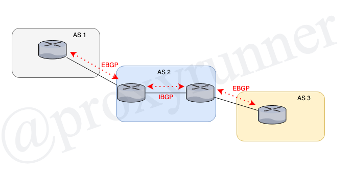
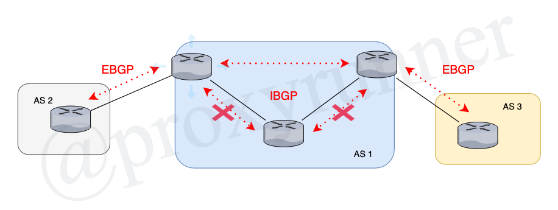

# Lesson 3: Configuring an IBGP Session

Click here to return to the [BGP Table of Contents](../README.md).

 * 3.1 : understanding a BGP session between peers in the same AS are discussed
 * 3.1 : using a topology with multiple routers within the same AS

 ## Configuring an IBGP Session

 * IBGP applications
 * similarities and differences between IBGP and EBGP
 * Unique IBGP issuess

 ## What is IBGP?

 * Internal BGP
 * Runs between neighbors in _the same_ autonomous system
 * Applications:
    + transports routes across a transit AS
    + transports routes internally in multihomed stub AS'

There will be many variations.  

## IBGP and EBGP

* Simialarities:
    + unicast point-to-point sessions
    + uses TCP port 179
* differences:
    + IBGP can traverse multiple router hops
        - EBGP (default) is between directly connected neighbors
* several intra-AS issues require special IBGP
    + Loop avoidance
    + next-hop address lookups
    + IGP synchronization
    +  Path redundancy

##  IBGP Issue #1 : Loop Avoidance

* The problem: AS_PATH has no relevance internally
* The solution: Force loop-free route advertisements
    + forward routes learned from external neighbors to internal neighbors
    + forward routes learned from internal neighbors to external neighbors
    + do not forward routes learned from an internal neighbor to other internal neighbors

##  IBGP Issue #2 : Routing to the Next-Hop Address

* the problem: potential lack of information on forwarding path to next-hop address
* the solution: Full IBGP mesh

This may be confusing at first since. Although individual neighborships between  R1/R2 and R2/R3 will not work due to previous statements. You'll be creating BGP sessions between R1, R2 and R2, R3 instead, while R1 and R3 remains a neighbors.

## IBGP Issue # 4 : IGP Synchronization

* IBGP/IGP synchronization rule:
    + Do not enter a BGP route into the routing table unless it is known by the IGP
    + Assumption: IGP is required to forward inter-AS packets across AS
* Unnecessary when full IBGP mesh is used
    + Must be disabled when IGP is not used for forwarding transit packets
* Modern default: No synchronization
People generally wont redistribute from BGP to an IGP, then back to a BGP.

---

[Previous Lesson](../2.2.md)

[Click here for the next lesson!](./3.2.md)
