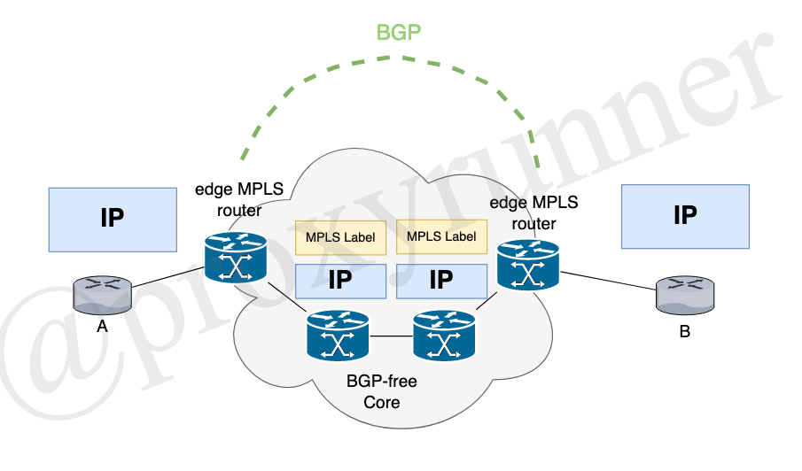

# MPLS Fundamentals

[Back](./READMD.md) to the table of contents.

* Tag Switching, 1998
* Label switching technique, replacing forwarding based on IP
* Labels are stackable, providing flexibility
* ATM and Frame Relay were very popular WAN protocols pre-2000
* MPLS started before 2000, and really took off in 2000 because of MPLS VPN

## Benefits of MPLS

* it not about faster forwarding
* unified network infrastructure
    + forwarding different protocols
* better IP over ATM intergration
* BGP-free core
* optimal traffic flow
* the peer-to-peer model MPLS VPN
* traffic engineering

## Peer-to-Peer Model for MPLS VPN

* advantages of peer-to-peer model
    + optimal traffic flow without full mesh of virtual circuits
    + better manageability
        - for example adding one customer router
    + only provision the link between provider and customer router
    + much better scalability
* disadvantages of the peer-to-peer model
    + provider participates in the routing of customer

## Traffic Engineering (TE)

* TE is source routing
* head end router dictates the path of the packet