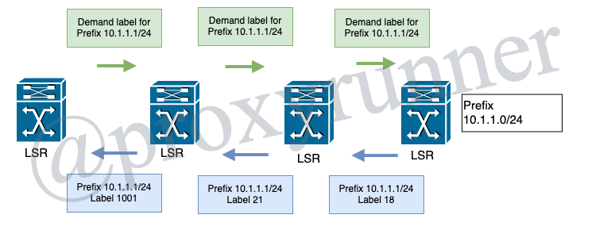

# Lesson 2: MPLS Architecture

## 2.2 Label Distribution Protocols

### Why Distribute Labels?

* One LSP will carry the labelled packet
* Each LSR must know which label was assigned to which LSP by the previous LSR
* Each LSR must know which label to put on the packet for the next LSR

## Two Distribution Modes

* Downstream-on-Demand (DoD) label distribution mode
    + Each LSR requests its next hop (that is, downstream) LSR on an LSP; a label binding for the FEC
    + Each LSR receives one binding per FEC, only from its downstream LSR on that FEC
* Unsolicited Downstream (UD) label distribution mode
    + Each LSR distributes a binding to its adjacent LSRs, without those LSRs a requesting a label
    + An LSR receives a remote label binding from each adjacent LSR

### The Two Distribution Modes

* Downstream-on-Demand (DoD) label distribution mode
    + one remote binding
* Unsolicited Downstream (UD) label distribution mode
    + likely more than one binding

## UD Label Distibribution Mode

* Likely more than one binding received per prefix

___

[Previous Lesson](./2.1.md)

[Click here for the next lesson!](./2.2.md)
